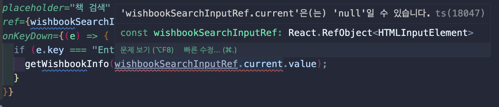
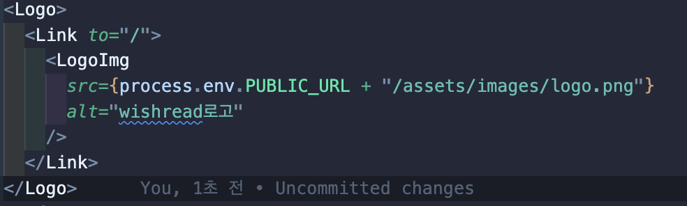
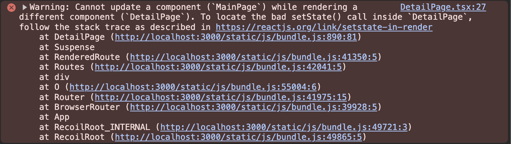

# 🚨 트러블 슈팅

- 문제가 발생했을때 원인을 규명하고 해결하는 작업을 의미

## ⛔️ useRef 사용시 문제발생



- useRef를 사용하여 value값을 보내주려고 하는데, useRef로 선언된 input이 null일 수도 있다는 에러메시지가 떴다.

## 문제해결

### 문제코드

```
<WishbookSearchInput
    type="text"
    placeholder="책 검색"
    ref={wishbookSearchInputRef}
    onKeyDown={(e) => {
        if (e.key === "Enter") {
            getWishbookInfo(wishbookSearchInputRef.current.value);
        }
    }}
/>
```

해결코드

```
<WishbookSearchInput
    type="text"
    placeholder="책 검색"
    ref={wishbookSearchInputRef}
    onKeyDown={(e) => {
        if (e.key === "Enter" && wishbookSearchInputRef.current) {
            getWishbookInfo(wishbookSearchInputRef.current.value);
        }
    }}
/>
```

useRef로 선언된 input의 value 값을 함수의 파라미터로 보내려고 했다. useRef.current의 값이 null 일 수도 있다는 문제를 확인했다. onKeyDown를 했을 때, e.key가 엔터이고, wishbookSearchInputRef.current 일 경우로 narrowing을 해줘서 문제를 해결했다.

## 느낀 점

typescript는 useRef를 사용할 때, null 일 경우를 대비하여, 좀 더 엄격한 narrowing을 해줘야한다는 것을 배웠습니다.

## ⛔️ image 경로 문제발생




- process.env.PUBLIC_URL 경로로 이미지 경로를 잡아주니, 이미지가 안뜨는 현상이 발생했다.

## 문제확인

- 이전 프로젝트에선 이미지 경로를 public 폴더 안에 넣고 진행을 했었는데, 이번 프로젝트에선 src 폴더에 이미지를 넣고 진행했다. src 폴더에 이미지를 추가한 이유는

      1. 추가 네트워크 요청을 피하기 위해 스크립트와 스타일시트가 축소되고 함께 번들된다.
      3.rebuild를 빠르게 가능!

- src 폴더에 있는 이미지를 사용하는 방법은 2가지가 있다.

  1.  import 방법  
      webpack을 사용하면 CSS 파일을 import 하는 것 처럼 이미지 파일도 import 해서 사용이 가능하다 따라서, 파일 최상단에 사용하려는 모든 이미지를 import해서 사용하는 방법이다.

  ```
    import myImage from './assets/myImage.jpg';
    const App = () => {
     return (
     
     );
    };
    export default App;
  ```

  2. require 방법

  - Node.js 환경이므로 require로 문서 어디서나 파일을 불러올 수 있음
  - default 를 붙이는 이유는 require를 사용하면 객체 형태로 값이 리턴되기 때문에, default 를 붙이면 문자열 형태 그대로 인식되게 만들어줌

  ```
  const App = () => {
   return (
      
   );
  };
  export default App;
  ```

## 문제해결

### 문제코드

```
<Logo>
    <Link to="/">
    <LogoImg
        src={process.env.PUBLIC_URL + "assets/images/logo.png"}
        alt="wishread로고"
    />
    </Link>
</Logo>

```

해결코드

```
<Logo>
    <Link to="/">
    <LogoImg
        src={require("assets/images/logo.png")}
        alt="wishread로고"
    />
    </Link>
</Logo>
```

## 느낀 점

src폴더에 이미지 폴더를 위치할 경우 이미지 경로를 어떤 식으로 넣어줘야 하는지 학습했다. 나의 생각은 일일이 import 하는 거보단 require로 쓰는게 좀 간편할 거 같다는 생각을 했다.

## ⛔️ Warning: To locate the bad setState() call inside `B`, follow the stack trace as described in \*\*\* 에러



- 조건문 안에 recoil로 상태관리중인 데이터를 넘겨주고 있는 과정에서 문제가 발생한다.

## 문제확인

- Mainpage에서 선택한 책 정보를 DetailPage 로 전달하기 위해, recoil 의 atom 으로 전역상태관리를 한 정보를 useRecoilState으로 넘겨주도록 했다.

  useRecoilState는 useState와 유사한 형태로 사용하기 때문에, const [recent, setRecent] = useRecoilState(recentState); 식으로 사용한다.

  setState를 useEffect 없이 사용해서 생기는 에러 문구였다.

## 문제해결

### 문제코드

```

  const [recent, setRecent] = useRecoilState(recentState);

  if (watch) {
    if (recent.findIndex((item: BookDTO) => item.isbn === result.isbn) === -1) {
      const res: string[] = [...recent];
      res.push(result);
      setRecent(res);
    }
  }

```

해결코드

```
useEffect(() => {
    if (watch) {
      if (recent.findIndex((item: any) => item.isbn === result.isbn) === -1) {
        const res: string[] = [...recent];
        res.push(result);
        setRecent(res);
      }
    }
  }, [recent]);
```

## 느낀 점

랜더링하는 동안 상태 설정자를 호출하지 않는 것이 큰 깨달음이였고, useEffect로 래핑하여 사용하는 것을 배웠다.


